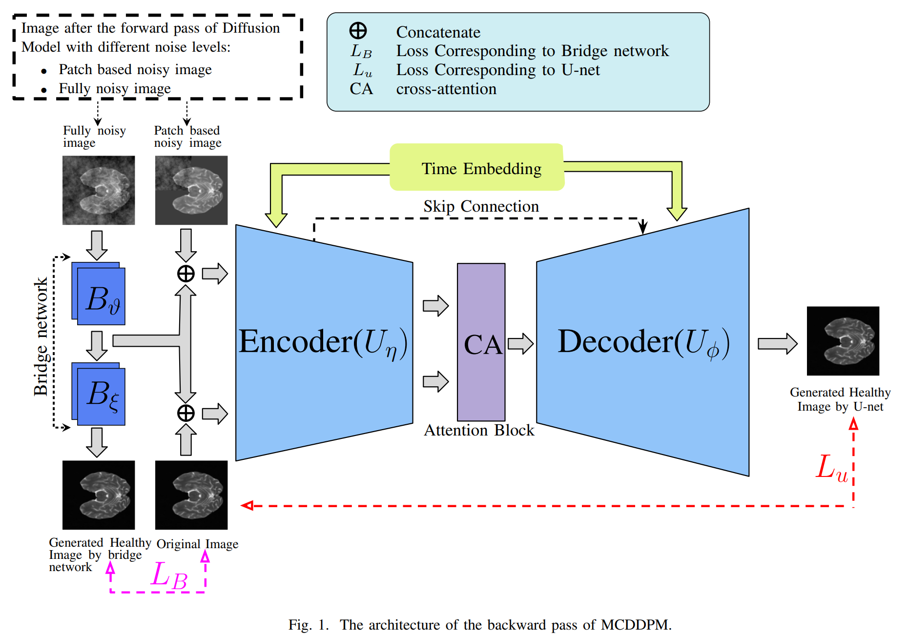
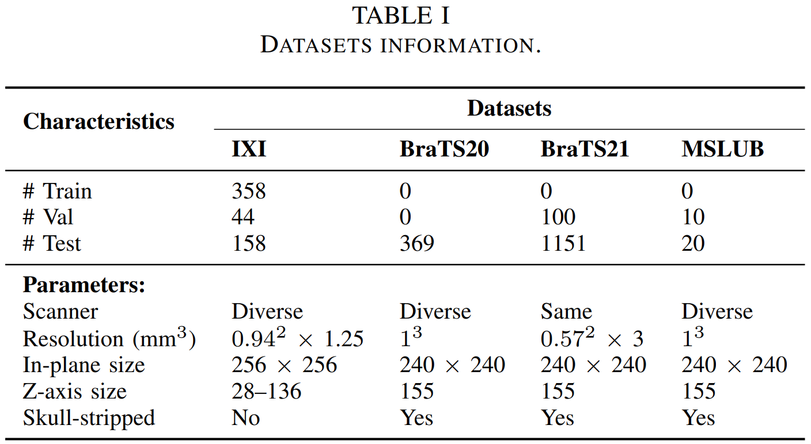
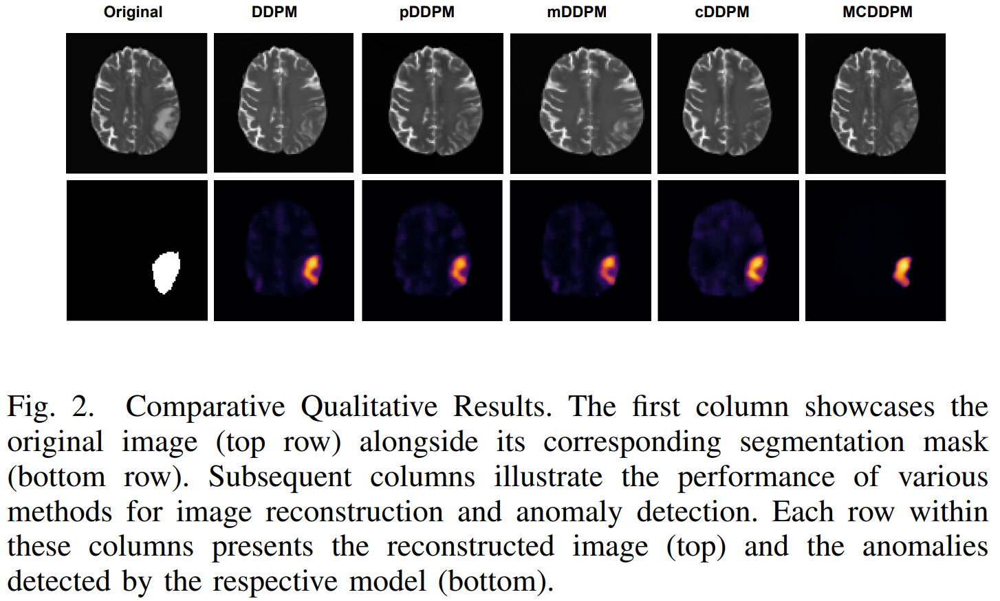
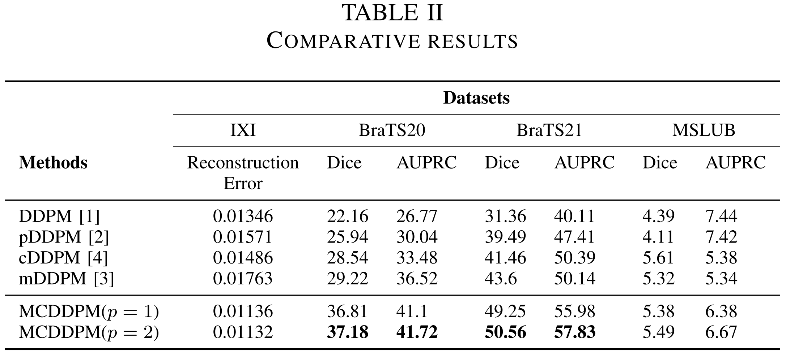

# MCDDPM: Multichannel Conditional Denoising Diffusion Model for Unsupervised Anomaly Detection in Brain MRI

This repository contains the code implementation for the paper "[MCDDPM: Multichannel Conditional Denoising Diffusion Model for Unsupervised Anomaly Detection in Brain MRI](https://www.researchgate.net/profile/Bheeshm-Sharma/)" by Vivek Kumar Trivedi, Bheeshm Sharma and P. Balamurugan, accepted by CSIP-BMEI 2024.

## Table of Contents
- [Introduction](#introduction)
- [Environment Set-up](#environment-set-up)
- [DataSets](#datasets)
- [Data-Preprocessing](#data-preprocessing)
- [Running MCDDPM](#running-mcddpm)
- [Results](#results)
- [Citation](#citation)
- [Acknowledgements](#acknowledgements)

## Introduction
Detecting anomalies in brain MRI scans using supervised deep learning methods presents challenges due to anatomical diversity and the labor-intensive requirement of pixel-level annotations. Generative models like Denoising Diffusion Probabilistic Models (DDPMs) and their variants such as Patch-based DDPMs (pDDPMs), Masked DDPMs (mDDPMs), and Conditional DDPMs (cDDPMs) have emerged as powerful alternatives for unsupervised anomaly detection in brain MRI scans. 
<!--These methods leverage sample-level labels of healthy brains to generate healthy tissues in brain MRI scans. During inference, when an anomalous (or unhealthy) scan image is presented as an input, these models generate a healthy scan image corresponding to the input anomalous scan, and the difference map between the generated healthy scan image and the original anomalous scan image provide the necessary pixel level identification of abnormal tissues. The generated healthy images from the DDPM, pDDPM and mDDPM models however suffer from fidelity issues and contain artifacts that do not have medical significance. While cDDPM achieves slightly better fidelity and artifact suppression, it requires huge memory footprint and is computationally expensive than the other DDPM based models. -->
In this work, we propose an improved version of DDPM called Multichannel Conditional Denoising Diffusion Probabilistic Model (MCDDPM) for unsupervised anomaly detection in brain MRI scans. Our proposed model achieves high fidelity by making use of additional information from the healthy images during the training process, enriching the representation power of DDPM models, with a computational cost and memory requirements  on par with DDPM, pDDPM and mDDPM models. Experimental results on BraTS20 and BraTS21 datasets demonstrate promising performance of the proposed method.
<!-- 

 -->
 


## Environment Set-up
To set up the environment, use the following installation instructions.

### Installation
1. Clone the repository:
    ```bash
    git clone https://github.com/vivekkumartri/MCDDPM.git
    ```
2. Update Environment Configuration:
    - After cloning, update the path in the `pc_environment.env` file located in the repository to match your local setup.
    
3. Navigate to the project directory:
    ```bash
    cd MCDDPM
    ```
4. Create and activate the Conda environment:
    ```bash
    conda env create -f environment_mcddpm.yml
    conda activate mcddpm
    ```

## DataSets
This project utilizes the following datasets:
- **IXI**: [Information eXtraction from Images 2020 dataset](https://brain-development.org/ixi-dataset/).  
  - **Download Working Link**: [IXI Dataset](https://www.nitrc.org/ir/app/action/ProjectDownloadAction/project/ixi)

- **BraTS20**: [Brain Tumor Segmentation Challenge 2020 dataset](https://www.med.upenn.edu/cbica/brats2020/data.html).  
  - **Download Working Link**: [BraTS20 Dataset on Kaggle](https://www.kaggle.com/datasets/awsaf49/brats20-dataset-training-validation?resource=download-directory)

- **BraTS21**: [Brain Tumor Segmentation Challenge 2021 dataset](http://braintumorsegmentation.org/).  
  - **Download Working Link**: [BraTS21 Dataset on Kaggle](https://www.kaggle.com/datasets/dschettler8845/brats-2021-task1/data)

- **MSLUB**: [The Multiple Sclerosis Dataset from The University Hospital of Ljubljana](https://lit.fe.uni-lj.si/en/research/resources/3D-MR-MS/).
  - **Download from the above link**

## Data Preprocessing

Before you begin processing, ensure that the downloaded ZIP files are extracted and arranged into the following directory structure:

    ├── IXI
    │   ├── t2 
    │   │   ├── IXI1.nii.gz
    │   │   ├── IXI2.nii.gz
    │   │   └── ... 
    │   └── ...
    ├── MSLUB
    │   ├── t2 
    │   │   ├── MSLUB1.nii.gz
    │   │   ├── MSLUB2.nii.gz
    │   │   └── ...
    │   ├── seg
    │   │   ├── MSLUB1_seg.nii.gz
    │   │   ├── MSLUB2_seg.nii.gz
    │   │   └── ...
    │   └── ...
    ├── Brats21
    │   ├── t2 
    │   │   ├── Brats1.nii.gz
    │   │   ├── Brats2.nii.gz
    │   │   └── ...
    │   ├── seg
    │   │   ├── Brats1_seg.nii.gz
    │   │   ├── Brats2_seg.nii.gz
    │   │   └── ...
    │   └── ...
    └── ...

The following preprocessing steps are performed on the datasets:
Please note that only the T2 modality has been utilized for our task.

1. **Skull Stripping**: HD-BET is utilized to remove skulls from the datasets.
2. **Affine Transformation**: Volumes are aligned to match the T2 modality of the SRI24-Atlas for consistency.
3. **Non-Relevant Region Removal**: Black, non-informative regions are removed from the images.
4. **Bias Field Correction**: N4 Bias field correction is applied to reduce noise.
5. **Volume Resampling**: For efficiency, the resolution is reduced by half, resulting in dimensions of [96 × 96 × 80] voxels.
6. **Slice Removal**: 15 slices from both the top and bottom of the volumes are removed, parallel to the transverse plane.

To preprocess the IXI dataset, run the following command:
1. **Set-Up of  [HD-BET](https://github.com/MIC-DKFZ/HD-BET)**:
   ```bash
    # Script to automate the setup of HD-BET, a tool for brain extraction in medical images.
    
    # Step 1: Clone the HD-BET repository
    git clone https://github.com/MIC-DKFZ/HD-BET
    
    # Step 2: Navigate into the HD-BET directory
    cd HD-BET
    
    # Step 3: Install the HD-BET package in editable mode
    pip install -e .
    
    # (Optional) Step 4: Modify the parameter directory
    # The default location for model parameters is ~/hd-bet_params.
    # To change this, you can edit HD_BET/paths.py and adjust the `folder_with_parameter_files` variable.
    ```

2. **For IXI dataset**:
    ```bash
    bash prepare_IXI.sh <input_dir> <output_dir>
    ```
- **`<input_dir>`**: Path to the directory where the dataset is stored in an organized manner as discussed previously.
- **`<output_dir>`**: Path where you want to store the preprocessed data.

Ensure that you replace `<input_dir>` and `<output_dir>` with the actual paths relevant to your setup.

Please refer to the `preprocessing/` directory in this repository for preprocessing for other datasets. Please use `prepare_Brats20.sh`, `prepare_Brats21.sh` and `prepare_MSLUB.sh` files for BraTS20, BraTS21 and MSLUB datasets respectively.

### Dataset Details

The table below provides information about the datasets used in this project:


For more details on each dataset preprocessing, refer to the respective dataset documentation and the `preprocessing/` directory in this repository.

## Running MCDDPM
1. **Complete Environment Setup**:
   - Ensure you have followed the Environment Set-up instructions to configure your environment properly.
2. **Train and Inference Using MCDDPM**:
   - Execute the following command to train and perform inference with the proposed MCDDPM model:
    ```bash
    python run.py experiment=/experiment/CISP_BMEI_MCDDPM/MCDDPM
    ```
3. **Comparative and Ablation Studies**:
   - For running comparative and ablation study experiments, please refer to the `config/` directory in this repository for additional configurations and scripts.
    ### Example
    
    ```bash
    python run.py experiment=/experiment/CISP_BMEI_MCDDPM/MCDDPM_without_Condition
    ```
## Results
<!--The MCDDPM model has demonstrated the following results on the evaluated datasets:
- **IXI**:
- **BraTS20**: 
- **BraTS21**: 
- **MSLUB**:
-->
### Qualitative results:
We present below a few comparisons in terms of qualitative and quantitative results.

<!--


-->

### Quantitative results:


## Citation
If you use this code in your research, please cite our paper:

<!--## License
This project is licensed under the MIT License.
-->
## Acknowledgements
We thank Technocraft Centre for Applied Artificial Intelligence (TCA2I), IIT Bombay, for their generous funding support towards this
project.

This project draws inspiration and is developed based on the [pddpm-uad](https://github.com/FinnBehrendt/patched-Diffusion-Models-UAD) repository.

